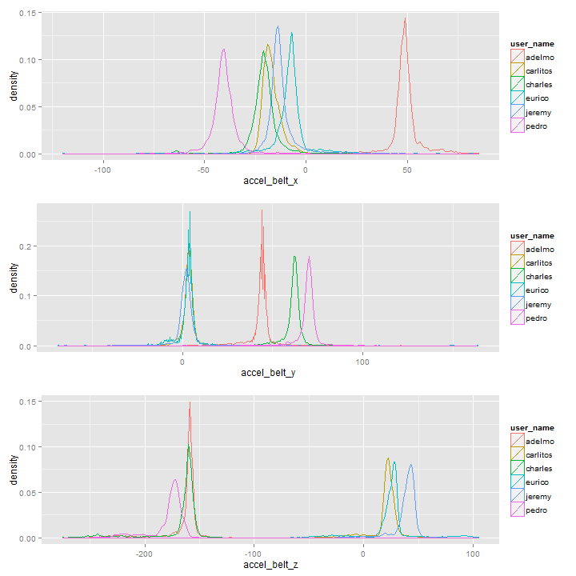

========================================================
Practical Machine Learning - Coursera Project
========================================================
<p>Marius Florin RADU
<br>Cluj-Napoca, Cluj, ROMANIA
<br>mail: radu_marius_florin@yahoo.com</p>
========================================================


Background
------------------------------------------------------------
Using devices such as Jawbone Up, Nike FuelBand, and Fitbit it is now possible to collect a large amount of data about personal activity relatively inexpensively. These type of devices are part of the quantified self movement – a group of enthusiasts who take measurements about themselves regularly to improve their health, to find patterns in their behavior, or because they are tech geeks. One thing that people regularly do is quantify how much of a particular activity they do, but they rarely quantify how well they do it. In this project, your goal will be to use data from accelerometers on the belt, forearm, arm, and dumbell of 6 participants. They were asked to perform barbell lifts correctly and incorrectly in 5 different ways. More information is available from the website here: [http://groupware.les.inf.puc-rio.br/har](http://groupware.les.inf.puc-rio.br/har) See the section on the Weight Lifting Exercise Dataset. 


Data 
------------------------------------------------------------
The training data for this project are available [HERE](ttps://d396qusza40orc.cloudfront.net/predmachlearn/pml-training.csv)

The test data are available [HERE](https://d396qusza40orc.cloudfront.net/predmachlearn/pml-testing.csv)

The data for this project come from this [SOURCE](http://groupware.les.inf.puc-rio.br/har). If you use the document you create for this class for any purpose please cite them as they have been very generous in allowing their data to be used for this kind of assignment. 

The Project Goal
------------------------------------------------------------
The goal of your project is to predict the manner in which they did the exercise. This is the **classe** variable in the training set. You may use any of the other variables to predict with. 
You should create a report describing:
- how you built your model 
- how you used cross validation 
- what you think the expected out of sample error is 
- why you made the choices you did 

You will also use your prediction model to predict 20 different test cases. 


The Approach
------------------------------------------------------------
**How you built your model?**

I’ve used **carret** package to built machine learning algorithm to predict activity quality from activity monitors.
I used Random Forest approach in a similar manner as did the authors of the main article associated with this data set ( in section 5.2 in the paper [HERE](http://groupware.les.inf.puc-rio.br/public/papers/2013.Velloso.QAR-WLE.pdf) ) Probably authors have been tested also other models and get happy with the results when using Random Forest. 
In an initial phase I’ve also tested Generalized Additive Model using Splines and Support Vector Machines with Polynomial Kernel Model from carret package, but for the final machine and the documentation bellow I’ve opted to keep only Random Forest models. The motivations are: **gam** and **svmPoly** are quite time/resources consuming (even if I’ve used parallel processing), and the results are comparable with **rf** which is relative faster.  

**How you used cross validation?** 

I’ve created a training set from `pml-training.csv` with 4907 instances (25% from file) ant the remaining set was used for cross-validation. Model was used to classify data from `pml-training.csv`.

**What you think the expected out of sample error is?** 

From the very beginning I expected for model (any to by finally adopted) an error rate less than 0.5% in test sample; a value which is close to the results presented in the main article.

**Why you made the choices you did?**

Bellow is what I did, decisions and the motivations. 

Phase 01 - Exploratory Analysis and Data Preparation
------------------------------------------------------------

```r
rm(list = ls())
setwd("D:/WORK_2014/Certification_Data_Science/Practical_Machine_Learning/Course_Project_Writeup/Data/")
list.files()
```

```
## [1] "pml-testing.csv"  "pml-training.csv"
```

```r

library(caret)
```

```
## Loading required package: lattice
## Loading required package: ggplot2
```

```r

dataRaw <- read.table("pml-training.csv", header = TRUE, nrows = 19622, sep = ",", 
    comment.char = "", na.strings = c("", "NA", "#DIV/0!"))

str(dataRaw)
```

```
## 'data.frame':	19622 obs. of  160 variables:
##  $ X                       : int  1 2 3 4 5 6 7 8 9 10 ...
##  $ user_name               : Factor w/ 6 levels "adelmo","carlitos",..: 2 2 2 2 2 2 2 2 2 2 ...
##  $ raw_timestamp_part_1    : int  1323084231 1323084231 1323084231 1323084232 1323084232 1323084232 1323084232 1323084232 1323084232 1323084232 ...
##  $ raw_timestamp_part_2    : int  788290 808298 820366 120339 196328 304277 368296 440390 484323 484434 ...
##  $ cvtd_timestamp          : Factor w/ 20 levels "02/12/2011 13:32",..: 9 9 9 9 9 9 9 9 9 9 ...
##  $ new_window              : Factor w/ 2 levels "no","yes": 1 1 1 1 1 1 1 1 1 1 ...
##  $ num_window              : int  11 11 11 12 12 12 12 12 12 12 ...
##  $ roll_belt               : num  1.41 1.41 1.42 1.48 1.48 1.45 1.42 1.42 1.43 1.45 ...
##  $ pitch_belt              : num  8.07 8.07 8.07 8.05 8.07 8.06 8.09 8.13 8.16 8.17 ...
##  $ yaw_belt                : num  -94.4 -94.4 -94.4 -94.4 -94.4 -94.4 -94.4 -94.4 -94.4 -94.4 ...
##  $ total_accel_belt        : int  3 3 3 3 3 3 3 3 3 3 ...
##  $ kurtosis_roll_belt      : num  NA NA NA NA NA NA NA NA NA NA ...
##  $ kurtosis_picth_belt     : num  NA NA NA NA NA NA NA NA NA NA ...
##  $ kurtosis_yaw_belt       : logi  NA NA NA NA NA NA ...
##  $ skewness_roll_belt      : num  NA NA NA NA NA NA NA NA NA NA ...
##  $ skewness_roll_belt.1    : num  NA NA NA NA NA NA NA NA NA NA ...
##  $ skewness_yaw_belt       : logi  NA NA NA NA NA NA ...
##  $ max_roll_belt           : num  NA NA NA NA NA NA NA NA NA NA ...
##  $ max_picth_belt          : int  NA NA NA NA NA NA NA NA NA NA ...
##  $ max_yaw_belt            : num  NA NA NA NA NA NA NA NA NA NA ...
##  $ min_roll_belt           : num  NA NA NA NA NA NA NA NA NA NA ...
##  $ min_pitch_belt          : int  NA NA NA NA NA NA NA NA NA NA ...
##  $ min_yaw_belt            : num  NA NA NA NA NA NA NA NA NA NA ...
##  $ amplitude_roll_belt     : num  NA NA NA NA NA NA NA NA NA NA ...
##  $ amplitude_pitch_belt    : int  NA NA NA NA NA NA NA NA NA NA ...
##  $ amplitude_yaw_belt      : num  NA NA NA NA NA NA NA NA NA NA ...
##  $ var_total_accel_belt    : num  NA NA NA NA NA NA NA NA NA NA ...
##  $ avg_roll_belt           : num  NA NA NA NA NA NA NA NA NA NA ...
##  $ stddev_roll_belt        : num  NA NA NA NA NA NA NA NA NA NA ...
##  $ var_roll_belt           : num  NA NA NA NA NA NA NA NA NA NA ...
##  $ avg_pitch_belt          : num  NA NA NA NA NA NA NA NA NA NA ...
##  $ stddev_pitch_belt       : num  NA NA NA NA NA NA NA NA NA NA ...
##  $ var_pitch_belt          : num  NA NA NA NA NA NA NA NA NA NA ...
##  $ avg_yaw_belt            : num  NA NA NA NA NA NA NA NA NA NA ...
##  $ stddev_yaw_belt         : num  NA NA NA NA NA NA NA NA NA NA ...
##  $ var_yaw_belt            : num  NA NA NA NA NA NA NA NA NA NA ...
##  $ gyros_belt_x            : num  0 0.02 0 0.02 0.02 0.02 0.02 0.02 0.02 0.03 ...
##  $ gyros_belt_y            : num  0 0 0 0 0.02 0 0 0 0 0 ...
##  $ gyros_belt_z            : num  -0.02 -0.02 -0.02 -0.03 -0.02 -0.02 -0.02 -0.02 -0.02 0 ...
##  $ accel_belt_x            : int  -21 -22 -20 -22 -21 -21 -22 -22 -20 -21 ...
##  $ accel_belt_y            : int  4 4 5 3 2 4 3 4 2 4 ...
##  $ accel_belt_z            : int  22 22 23 21 24 21 21 21 24 22 ...
##  $ magnet_belt_x           : int  -3 -7 -2 -6 -6 0 -4 -2 1 -3 ...
##  $ magnet_belt_y           : int  599 608 600 604 600 603 599 603 602 609 ...
##  $ magnet_belt_z           : int  -313 -311 -305 -310 -302 -312 -311 -313 -312 -308 ...
##  $ roll_arm                : num  -128 -128 -128 -128 -128 -128 -128 -128 -128 -128 ...
##  $ pitch_arm               : num  22.5 22.5 22.5 22.1 22.1 22 21.9 21.8 21.7 21.6 ...
##  $ yaw_arm                 : num  -161 -161 -161 -161 -161 -161 -161 -161 -161 -161 ...
##  $ total_accel_arm         : int  34 34 34 34 34 34 34 34 34 34 ...
##  $ var_accel_arm           : num  NA NA NA NA NA NA NA NA NA NA ...
##  $ avg_roll_arm            : num  NA NA NA NA NA NA NA NA NA NA ...
##  $ stddev_roll_arm         : num  NA NA NA NA NA NA NA NA NA NA ...
##  $ var_roll_arm            : num  NA NA NA NA NA NA NA NA NA NA ...
##  $ avg_pitch_arm           : num  NA NA NA NA NA NA NA NA NA NA ...
##  $ stddev_pitch_arm        : num  NA NA NA NA NA NA NA NA NA NA ...
##  $ var_pitch_arm           : num  NA NA NA NA NA NA NA NA NA NA ...
##  $ avg_yaw_arm             : num  NA NA NA NA NA NA NA NA NA NA ...
##  $ stddev_yaw_arm          : num  NA NA NA NA NA NA NA NA NA NA ...
##  $ var_yaw_arm             : num  NA NA NA NA NA NA NA NA NA NA ...
##  $ gyros_arm_x             : num  0 0.02 0.02 0.02 0 0.02 0 0.02 0.02 0.02 ...
##  $ gyros_arm_y             : num  0 -0.02 -0.02 -0.03 -0.03 -0.03 -0.03 -0.02 -0.03 -0.03 ...
##  $ gyros_arm_z             : num  -0.02 -0.02 -0.02 0.02 0 0 0 0 -0.02 -0.02 ...
##  $ accel_arm_x             : int  -288 -290 -289 -289 -289 -289 -289 -289 -288 -288 ...
##  $ accel_arm_y             : int  109 110 110 111 111 111 111 111 109 110 ...
##  $ accel_arm_z             : int  -123 -125 -126 -123 -123 -122 -125 -124 -122 -124 ...
##  $ magnet_arm_x            : int  -368 -369 -368 -372 -374 -369 -373 -372 -369 -376 ...
##  $ magnet_arm_y            : int  337 337 344 344 337 342 336 338 341 334 ...
##  $ magnet_arm_z            : int  516 513 513 512 506 513 509 510 518 516 ...
##  $ kurtosis_roll_arm       : num  NA NA NA NA NA NA NA NA NA NA ...
##  $ kurtosis_picth_arm      : num  NA NA NA NA NA NA NA NA NA NA ...
##  $ kurtosis_yaw_arm        : num  NA NA NA NA NA NA NA NA NA NA ...
##  $ skewness_roll_arm       : num  NA NA NA NA NA NA NA NA NA NA ...
##  $ skewness_pitch_arm      : num  NA NA NA NA NA NA NA NA NA NA ...
##  $ skewness_yaw_arm        : num  NA NA NA NA NA NA NA NA NA NA ...
##  $ max_roll_arm            : num  NA NA NA NA NA NA NA NA NA NA ...
##  $ max_picth_arm           : num  NA NA NA NA NA NA NA NA NA NA ...
##  $ max_yaw_arm             : int  NA NA NA NA NA NA NA NA NA NA ...
##  $ min_roll_arm            : num  NA NA NA NA NA NA NA NA NA NA ...
##  $ min_pitch_arm           : num  NA NA NA NA NA NA NA NA NA NA ...
##  $ min_yaw_arm             : int  NA NA NA NA NA NA NA NA NA NA ...
##  $ amplitude_roll_arm      : num  NA NA NA NA NA NA NA NA NA NA ...
##  $ amplitude_pitch_arm     : num  NA NA NA NA NA NA NA NA NA NA ...
##  $ amplitude_yaw_arm       : int  NA NA NA NA NA NA NA NA NA NA ...
##  $ roll_dumbbell           : num  13.1 13.1 12.9 13.4 13.4 ...
##  $ pitch_dumbbell          : num  -70.5 -70.6 -70.3 -70.4 -70.4 ...
##  $ yaw_dumbbell            : num  -84.9 -84.7 -85.1 -84.9 -84.9 ...
##  $ kurtosis_roll_dumbbell  : num  NA NA NA NA NA NA NA NA NA NA ...
##  $ kurtosis_picth_dumbbell : num  NA NA NA NA NA NA NA NA NA NA ...
##  $ kurtosis_yaw_dumbbell   : logi  NA NA NA NA NA NA ...
##  $ skewness_roll_dumbbell  : num  NA NA NA NA NA NA NA NA NA NA ...
##  $ skewness_pitch_dumbbell : num  NA NA NA NA NA NA NA NA NA NA ...
##  $ skewness_yaw_dumbbell   : logi  NA NA NA NA NA NA ...
##  $ max_roll_dumbbell       : num  NA NA NA NA NA NA NA NA NA NA ...
##  $ max_picth_dumbbell      : num  NA NA NA NA NA NA NA NA NA NA ...
##  $ max_yaw_dumbbell        : num  NA NA NA NA NA NA NA NA NA NA ...
##  $ min_roll_dumbbell       : num  NA NA NA NA NA NA NA NA NA NA ...
##  $ min_pitch_dumbbell      : num  NA NA NA NA NA NA NA NA NA NA ...
##  $ min_yaw_dumbbell        : num  NA NA NA NA NA NA NA NA NA NA ...
##  $ amplitude_roll_dumbbell : num  NA NA NA NA NA NA NA NA NA NA ...
##   [list output truncated]
```


Discard NAs columns from data set

```r
dataNoNA <- subset(dataRaw, select = colMeans(is.na(dataRaw)) == 0)
```


Check data structure. Check missing data from the new No NA data set. Credits to `Stephen Turner` on **GitHub** for **propmiss** function bellow

```r
dim(dataNoNA)
```

```
## [1] 19622    60
```

```r

propmiss <- function(dataframe) {
    m <- sapply(dataframe, function(x) {
        data.frame(nmiss = sum(is.na(x)), n = length(x), propmiss = sum(is.na(x))/length(x))
    })
    d <- data.frame(t(m))
    d <- sapply(d, unlist)
    d <- as.data.frame(d)
    d$variable <- row.names(d)
    row.names(d) <- NULL
    d <- cbind(d[ncol(d)], d[-ncol(d)])
    return(d[order(d$propmiss), ])
}

pm1 <- propmiss(dataRaw)
pm2 <- propmiss(dataNoNA)
```


Check in detail the structure of certain variables: `user_name`, `X`

```r
table(dataNoNA$user_name)
```

```
## 
##   adelmo carlitos  charles   eurico   jeremy    pedro 
##     3892     3112     3536     3070     3402     2610
```

```r
# str(dataNoNA$X)
```


This is bellow only one of the plots I've used in exploratory phase. The value of this kind plots consists in a better understanding of data and problem.

```r
library(gridExtra)
```

```
## Loading required package: grid
```

```r
p1 <- qplot(accel_belt_x, colour = user_name, data = dataNoNA, geom = "density")
p2 <- qplot(accel_belt_y, colour = user_name, data = dataNoNA, geom = "density")
p3 <- qplot(accel_belt_z, colour = user_name, data = dataNoNA, geom = "density")
grid.arrange(p1, p2, p3, nrow = 3)
```

 


Eliminate timestam variable `cvtd_timestamp`, this is a factor variable which is already captured by other avriables: `raw_timestamp_part_1` and `raw_timestamp_part_2`. This variable might work as a predictor, but it would have no real ML case utility.

```r
dataNoNANoTS <- dataNoNA[, -c(5)]
# str(dataNoNANoTS)
```


Create dummy variables from factor variables


```r
head(model.matrix(classe ~ ., data = dataNoNANoTS), 2)
```

```
##   (Intercept) X user_namecarlitos user_namecharles user_nameeurico
## 1           1 1                 1                0               0
## 2           1 2                 1                0               0
##   user_namejeremy user_namepedro raw_timestamp_part_1 raw_timestamp_part_2
## 1               0              0            1.323e+09               788290
## 2               0              0            1.323e+09               808298
##   new_windowyes num_window roll_belt pitch_belt yaw_belt total_accel_belt
## 1             0         11      1.41       8.07    -94.4                3
## 2             0         11      1.41       8.07    -94.4                3
##   gyros_belt_x gyros_belt_y gyros_belt_z accel_belt_x accel_belt_y
## 1         0.00            0        -0.02          -21            4
## 2         0.02            0        -0.02          -22            4
##   accel_belt_z magnet_belt_x magnet_belt_y magnet_belt_z roll_arm
## 1           22            -3           599          -313     -128
## 2           22            -7           608          -311     -128
##   pitch_arm yaw_arm total_accel_arm gyros_arm_x gyros_arm_y gyros_arm_z
## 1      22.5    -161              34        0.00        0.00       -0.02
## 2      22.5    -161              34        0.02       -0.02       -0.02
##   accel_arm_x accel_arm_y accel_arm_z magnet_arm_x magnet_arm_y
## 1        -288         109        -123         -368          337
## 2        -290         110        -125         -369          337
##   magnet_arm_z roll_dumbbell pitch_dumbbell yaw_dumbbell
## 1          516         13.05         -70.49       -84.87
## 2          513         13.13         -70.64       -84.71
##   total_accel_dumbbell gyros_dumbbell_x gyros_dumbbell_y gyros_dumbbell_z
## 1                   37                0            -0.02                0
## 2                   37                0            -0.02                0
##   accel_dumbbell_x accel_dumbbell_y accel_dumbbell_z magnet_dumbbell_x
## 1             -234               47             -271              -559
## 2             -233               47             -269              -555
##   magnet_dumbbell_y magnet_dumbbell_z roll_forearm pitch_forearm
## 1               293               -65         28.4         -63.9
## 2               296               -64         28.3         -63.9
##   yaw_forearm total_accel_forearm gyros_forearm_x gyros_forearm_y
## 1        -153                  36            0.03               0
## 2        -153                  36            0.02               0
##   gyros_forearm_z accel_forearm_x accel_forearm_y accel_forearm_z
## 1           -0.02             192             203            -215
## 2           -0.02             192             203            -216
##   magnet_forearm_x magnet_forearm_y magnet_forearm_z
## 1              -17              654              476
## 2              -18              661              473
```

```r
dummies <- dummyVars(classe ~ ., data = dataNoNANoTS)
# head(predict(dummies, newdata = dataNoNANoTS))
dataFrame01 <- data.frame(predict(dummies, newdata = dataNoNANoTS))
# head(dataFrame01) str(dataFrame01)
```


Determine and eliminate Zero- and Near Zero-Variance Predictors

```r
nzv <- nearZeroVar(dataFrame01, saveMetrics = TRUE)
nzv[nzv$nzv, ]
```

```
##                freqRatio percentUnique zeroVar  nzv
## new_window.no      47.33       0.01019   FALSE TRUE
## new_window.yes     47.33       0.01019   FALSE TRUE
```

```r

# str(dataFrame01)
dataFrame02 <- dataFrame01[, -c(10, 11)]
# str(dataFrame02)
```


Check for Linera Dependencies

```r
comboInfo <- findLinearCombos(dataFrame02)
# comboInfo str(dataFrame02)
names(dataFrame02)[8]
```

```
## [1] "raw_timestamp_part_1"
```


Due to linear dependency will eliminate column `raw_timestamp_part_1`. Also  do not include the row number X in the predictors.

```r
dataFrame03 <- dataFrame02[, -c(1, 8)]
# str(dataFrame03) names(dataFrame03)
```


Construct the main data frame containing predicted variable "classe"

```r
dataFrame04 <- data.frame(dataFrame03, classe = dataNoNANoTS$classe)
# names(dataFrame04) summary(dataFrame04)
```


Phase 02 - ML Model Construction
------------------------------------------------------------

```r
set.seed(1978)
inTraining <- createDataPartition(dataFrame04$classe, p = 0.25, list = FALSE)
training <- dataFrame04[inTraining, ]
testing <- dataFrame04[-inTraining, ]

dim(training)
```

```
## [1] 4907   61
```

```r
dim(testing)
```

```
## [1] 14715    61
```


Parameter Tuning: We will split your data 10-fold and perform cross-validation as it trains the model.

```r
# Version 1
fitControl <- trainControl(method = "repeatedcv", number = 10, repeats = 10, 
    classProbs = TRUE, savePred = T)

# Version 2
fitControl <- trainControl(method = "cv", number = 10, classProbs = TRUE, savePred = T)
```


Parallel Processing Set Up with Snow and Model fitting with Random Forest
We use scaled and centered training data


```r
library(doSNOW)
```

```
## Loading required package: foreach
## Loading required package: iterators
## Loading required package: snow
```

```r
library(foreach)
library(caret)

cl <- makeCluster(3)
registerDoSNOW(cl)

rfFit <- train(classe ~ ., data = training, method = "rf", trControl = fitControl, 
    preProc = c("center", "scale"), allowParallel = TRUE)
```

```
## Loading required package: randomForest
## randomForest 4.6-7
## Type rfNews() to see new features/changes/bug fixes.
## Loading required package: class
```

```r


stopCluster(cl)
```


Find time elapsed for the model

```r
rfFit$times
```

```
## $everything
##    user  system elapsed 
##   15.41    0.08  174.81 
## 
## $final
##    user  system elapsed 
##   14.74    0.03   14.77 
## 
## $prediction
## [1] NA NA NA
```


Print final model

```r
print(rfFit$finalModel)
```

```
## 
## Call:
##  randomForest(x = x, y = y, mtry = param$mtry, allowParallel = TRUE) 
##                Type of random forest: classification
##                      Number of trees: 500
## No. of variables tried at each split: 31
## 
##         OOB estimate of  error rate: 1.14%
## Confusion matrix:
##      A   B   C   D   E class.error
## A 1394   0   0   0   1   0.0007168
## B   15 930   4   1   0   0.0210526
## C    0  10 843   3   0   0.0151869
## D    0   3   9 792   0   0.0149254
## E    1   2   1   6 892   0.0110865
```


Test Prediction
-------------------------------------------------------------

```r
predictionsTraining <- predict(rfFit, training)
confusionMatrix(predictionsTraining, training$classe)
```

```
## Confusion Matrix and Statistics
## 
##           Reference
## Prediction    A    B    C    D    E
##          A 1395    0    0    0    0
##          B    0  950    0    0    0
##          C    0    0  856    0    0
##          D    0    0    0  804    0
##          E    0    0    0    0  902
## 
## Overall Statistics
##                                     
##                Accuracy : 1         
##                  95% CI : (0.999, 1)
##     No Information Rate : 0.284     
##     P-Value [Acc > NIR] : <2e-16    
##                                     
##                   Kappa : 1         
##  Mcnemar's Test P-Value : NA        
## 
## Statistics by Class:
## 
##                      Class: A Class: B Class: C Class: D Class: E
## Sensitivity             1.000    1.000    1.000    1.000    1.000
## Specificity             1.000    1.000    1.000    1.000    1.000
## Pos Pred Value          1.000    1.000    1.000    1.000    1.000
## Neg Pred Value          1.000    1.000    1.000    1.000    1.000
## Prevalence              0.284    0.194    0.174    0.164    0.184
## Detection Rate          0.284    0.194    0.174    0.164    0.184
## Detection Prevalence    0.284    0.194    0.174    0.164    0.184
## Balanced Accuracy       1.000    1.000    1.000    1.000    1.000
```

```r

predictionsTesting <- predict(rfFit, newdata = testing)
confusionMatrix(predictionsTesting, testing$classe)
```

```
## Confusion Matrix and Statistics
## 
##           Reference
## Prediction    A    B    C    D    E
##          A 4185   31    0    0    0
##          B    0 2789   26    2   11
##          C    0   19 2537   29    0
##          D    0    8    3 2378   19
##          E    0    0    0    3 2675
## 
## Overall Statistics
##                                         
##                Accuracy : 0.99          
##                  95% CI : (0.988, 0.991)
##     No Information Rate : 0.284         
##     P-Value [Acc > NIR] : <2e-16        
##                                         
##                   Kappa : 0.987         
##  Mcnemar's Test P-Value : NA            
## 
## Statistics by Class:
## 
##                      Class: A Class: B Class: C Class: D Class: E
## Sensitivity             1.000    0.980    0.989    0.986    0.989
## Specificity             0.997    0.997    0.996    0.998    1.000
## Pos Pred Value          0.993    0.986    0.981    0.988    0.999
## Neg Pred Value          1.000    0.995    0.998    0.997    0.998
## Prevalence              0.284    0.193    0.174    0.164    0.184
## Detection Rate          0.284    0.190    0.172    0.162    0.182
## Detection Prevalence    0.287    0.192    0.176    0.164    0.182
## Balanced Accuracy       0.999    0.988    0.992    0.992    0.994
```

```r

## We have the model accuracy
confusionMatrix(predictionsTesting, testing$classe)$overall
```

```
##       Accuracy          Kappa  AccuracyLower  AccuracyUpper   AccuracyNull 
##         0.9897         0.9870         0.9880         0.9913         0.2844 
## AccuracyPValue  McnemarPValue 
##         0.0000            NaN
```


Use the Model for the Practical Exercise
------------------------------------------------------------

```r
setwd("D:/WORK_2014/Certification_Data_Science/Practical_Machine_Learning/Course_Project_Writeup/Data/")
# list.files()

dataRaw <- read.table("pml-training.csv", header = TRUE, nrows = 19622, sep = ",", 
    comment.char = "", na.strings = c("", "NA", "#DIV/0!"))

dataRawTest <- read.table("pml-testing.csv", header = TRUE, nrows = 19622, sep = ",", 
    comment.char = "", na.strings = c("", "NA", "#DIV/0!"))

# intersect(names(dataRaw),names(dataRawTest))
setdiff(names(dataRaw), names(dataRawTest))
```

```
## [1] "classe"
```

```r
setdiff(names(dataRawTest), names(dataRaw))
```

```
## [1] "problem_id"
```

```r

names(dataRawTest)[160]
```

```
## [1] "problem_id"
```

```r
names(dataRawTest)[160] <- "classe"
dataRawTest$classe <- NA

dataRaw$Set <- 1
dataRawTest$Set <- 2

allDataRaw <- rbind(dataRaw, dataRawTest)
```


Discard NAs columns from data set

```r
dataNoNA <- dataRaw[, colSums(is.na(dataRaw)) == 0]
dataNoNA <- subset(allDataRaw, select = colMeans(is.na(dataRaw)) == 0)
```


Check missing data from the new No NA data set.

```r
pm3 <- propmiss(dataNoNA)

dataNoNANoTS <- dataNoNA[, -c(5)]

# head(model.matrix(classe ~ ., data = dataNoNANoTS))
dummies <- dummyVars(classe ~ ., data = dataNoNANoTS)
# head(predict(dummies, newdata = dataNoNANoTS))
dataFrame01 <- data.frame(predict(dummies, newdata = dataNoNANoTS))

nzv <- nearZeroVar(dataFrame01, saveMetrics = TRUE)
nzv[nzv$nzv, ]
```

```
##                freqRatio percentUnique zeroVar  nzv
## new_window.no      47.38       0.01018   FALSE TRUE
## new_window.yes     47.38       0.01018   FALSE TRUE
## Set               981.10       0.01018   FALSE TRUE
```

```r

# str(dataFrame01)
dataFrame02 <- dataFrame01[, -c(10, 11)]
# str(dataFrame02)

comboInfo <- findLinearCombos(dataFrame02)
# comboInfo
names(dataFrame02)[8]
```

```
## [1] "raw_timestamp_part_1"
```

```r

dataFrame03 <- dataFrame02[, -c(1, 8)]

dataFrame04 <- data.frame(dataFrame03, classe = dataNoNANoTS$classe)
# summary(dataFrame04)

dataFrame05 <- dataFrame04[which(dataFrame04$Set == 2), ]
# dim(dataFrame05)

dataFrame06 <- dataFrame05[, -c(62, 63)]
# dim(dataFrame06) summary(dataFrame06)

predictionsExercise <- predict(rfFit, newdata = dataFrame06)
predictionsExercise
```

```
##  [1] B A B A A E D B A A B C B A E E A B B B
## Levels: A B C D E
```


